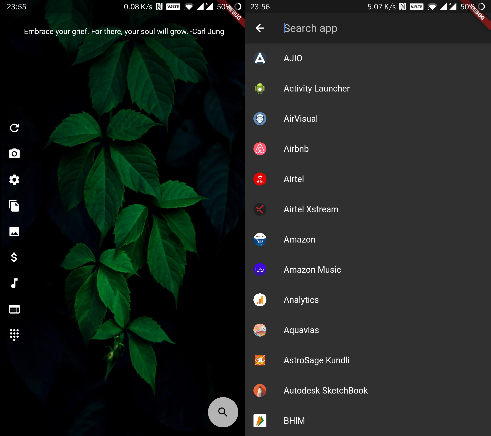

# Anchor

An android launcher designed for personal use. 

I wanted a home screen where I could 

1. have bunch of app shortcuts 
1. see todo for the day
1. add widgets to count drinking water [x]
1. widget to see visitor counter [x]
1. solar energy stats from panels at my home [x]

[x] - These are mere examples of the things I want to do and are not implemented currently.

I did not needed android widgets nor app drawer so this is what I came up with. Developing apps in flutter is so easy and super fast that I thought it would be better to make a custom home screen than installing and configuring dozen other apps.

Regarding the todo, it's a file on remote raspberry pi server that gets fetched when you hit the refresh button. You can add items to that todo list from your browser address bar! This is achieved with another self hosted solution that I had implemented https://github.com/quaintdev/pinotes

Take a look at screenshots below

